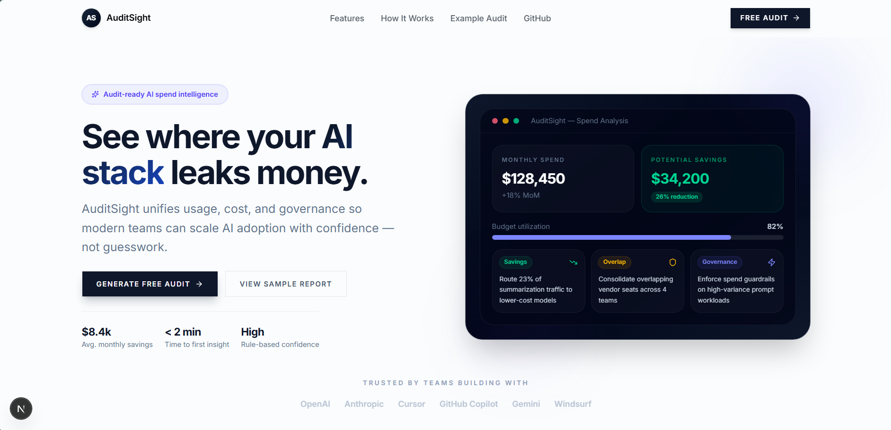
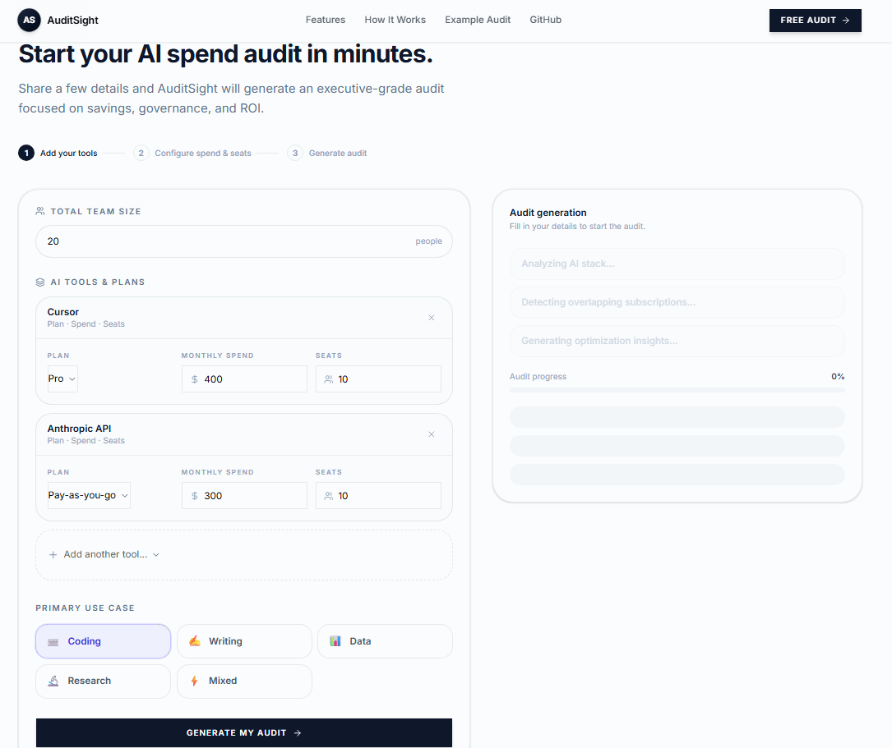
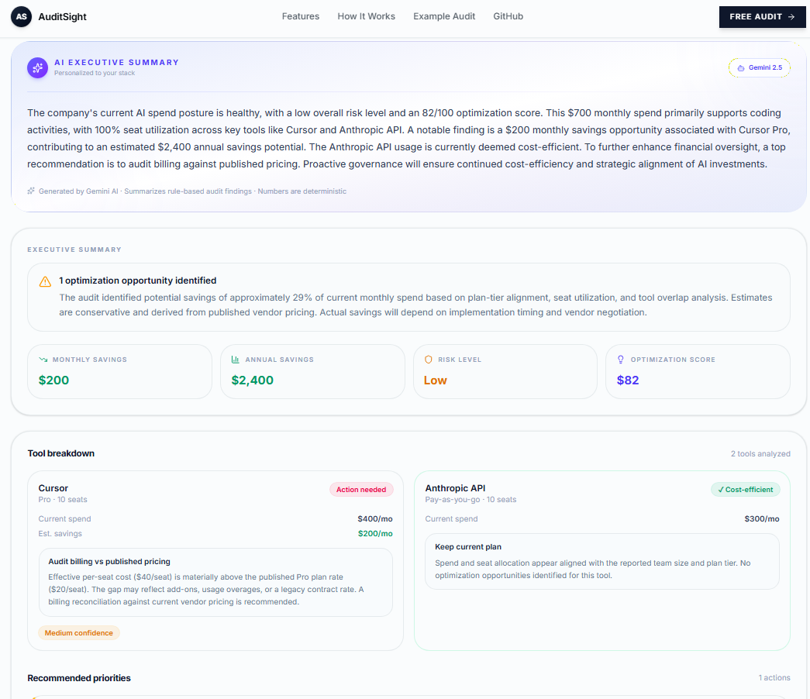

# AuditSight

## Project Summary

AuditSight is a full-stack AI spend audit platform that helps teams understand where they may be overspending across tools like ChatGPT, Claude, Cursor, Copilot, and Gemini. The product analyzes tooling plans, seat counts, and monthly spend to generate a structured audit report with optimization recommendations, projected savings, and an executive summary.

I built it for engineering teams, operators, and finance stakeholders who want clearer visibility into AI tooling costs without relying on vague AI-generated recommendations. Most of the audit logic is deterministic and pricing-driven so the recommendations stay explainable and defensible.

---

## Screenshots / Demo

**Loom demo:**
[https://www.loom.com/share/641394fff0364773950d12e7014c2441](https://www.loom.com/share/641394fff0364773950d12e7014c2441)

### Landing Page



### Onboarding Flow



### Audit Results Dashboard



---

## Quick Start

### Installation

```bash
npm install
```

### Environment Variables

Create a `.env.local` file at the project root:

```bash
GEMINI_API_KEY=your_gemini_key

NEXT_PUBLIC_SUPABASE_URL=https://your-project.supabase.co
NEXT_PUBLIC_SUPABASE_ANON_KEY=your_anon_key
SUPABASE_SERVICE_ROLE_KEY=your_service_role_key

RESEND_API_KEY=your_resend_key
FROM_EMAIL=onboarding@resend.dev

NEXT_PUBLIC_SITE_URL=https://audit-sight.vercel.app
```

### Run Locally

```bash
npm run dev
```

### Run Tests

```bash
npm run test
```

### Production Build

```bash
npm run build
```

### Deployment

AuditSight is deployed on Vercel. To deploy your own version:

1. Push the repository to GitHub
2. Import the project into Vercel
3. Add the required environment variables
4. Deploy

The project uses:

* Next.js App Router
* Supabase for persistence
* Gemini for executive summaries
* Resend for transactional emails
* GitHub Actions for CI validation

---

## Decisions

* **Moved from generic tool selection to structured vendor plans:**
	The initial onboarding flow only captured which AI tools a team used, but the audit recommendations felt too shallow. I refactored the entire intake system to model actual vendor plans, spend, and seat counts so the recommendations could be tied to real pricing differences instead of vague optimization advice.

* **Separated the marketing site from the audit application flow:**
	Early versions mixed the landing page and onboarding logic together, which became difficult to manage once persistence, routing, and report generation were added. Splitting the marketing experience from the audit flow made the architecture cleaner and easier to evolve.

* **Kept the audit calculations rule-based instead of letting the LLM decide savings:**
	During development I experimented with more AI-generated recommendations, but the outputs became inconsistent and financially hard to justify. I ended up using deterministic pricing logic for the actual audit engine and reserved Gemini only for executive summaries.

* **Used session-based gated reports instead of adding full authentication:**
	I wanted the report unlock flow to feel like a realistic SaaS lead-capture experience without building a complete auth system during the MVP phase. The trade-off was managing unlock state manually through session persistence and public audit routes.

* **Prioritized frontend polish later in development instead of at the beginning:**
	The project initially looked functional but visually rough because most of the effort went into persistence, schema stability, routing, and audit credibility first. Once the backend architecture stabilized, I did a larger frontend redesign focused on animations, motion, hierarchy, and executive-style presentation quality.

---

## Live Product

[https://audit-sight.vercel.app](https://audit-sight.vercel.app)
